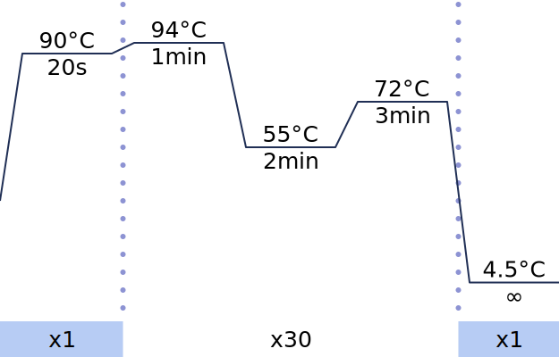

# Husky


A javascript library for drawing PCR temperature cycle graphs.

Sample: https://codepen.io/kmcstrelka/pen/XWoBMKK



## Usage

Add Husky to your html file.

```html
<script src="https://filedn.eu/lvYgiUks5MDjIQL8MIRrDf4/javascript/husky.js"></script>
```

Prepare an empty element for a graph. (Specifying an element for which a child element already exists will overwrite the current child element.)

```html
<div id="husky"></div>
```

Describe temperature, time, and number of cycles separated by commas, and separate each with a semicolon. (In the example, a line break is inserted after the semicolon for clarity, but it can be omitted.)
The number of cycles and time can be omitted.

```javascript
let inputtext=`
90 ,94 ,55 ,72  ,4.5;
20s,1min,2min,3min,∞;
x1 ,x30,   ,    ,x1;
`;
```

Create an instance from the Husky class and execute the makeGraph method.

```javascript
let graph = new Husky(inputtext);
graph.makeGraph(document.getElementById("graph"));
```
